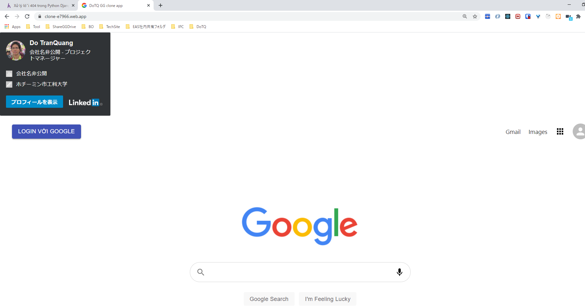
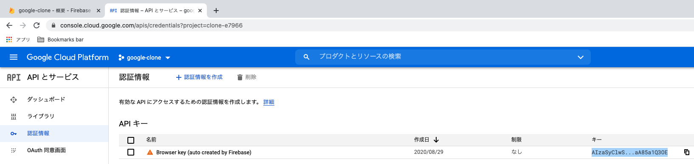
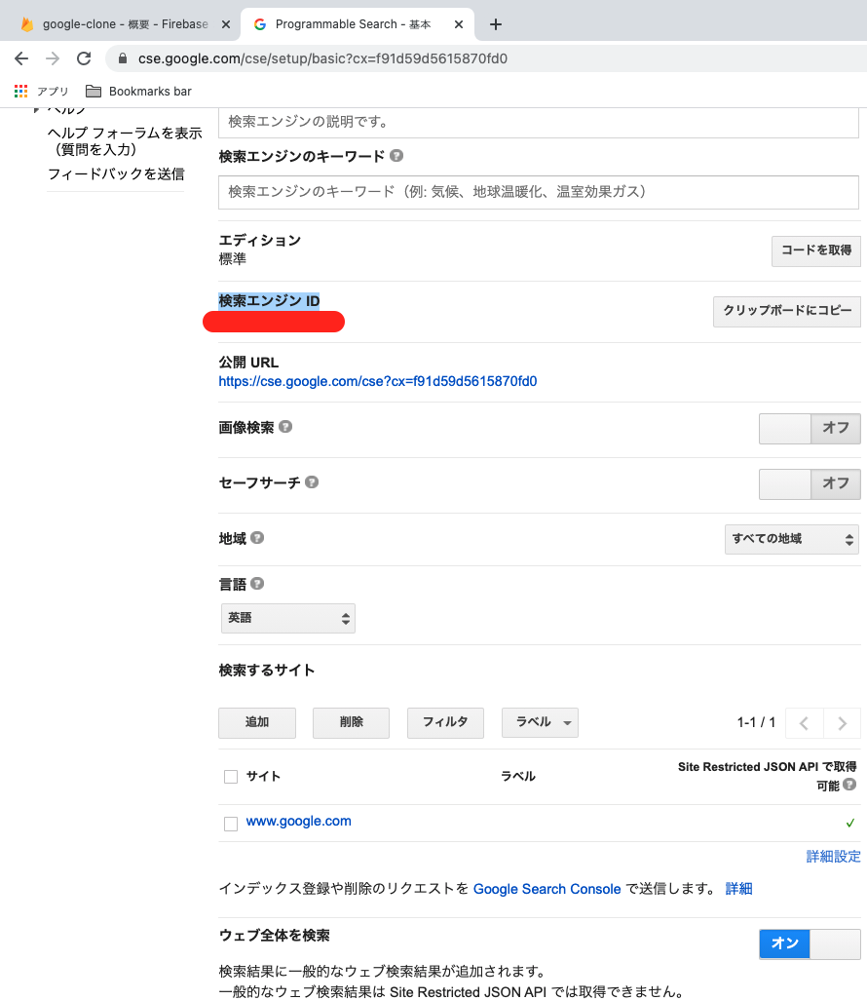
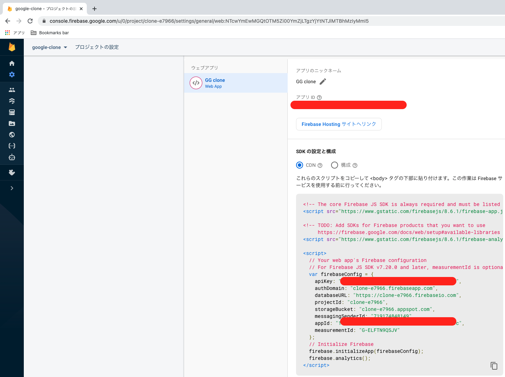
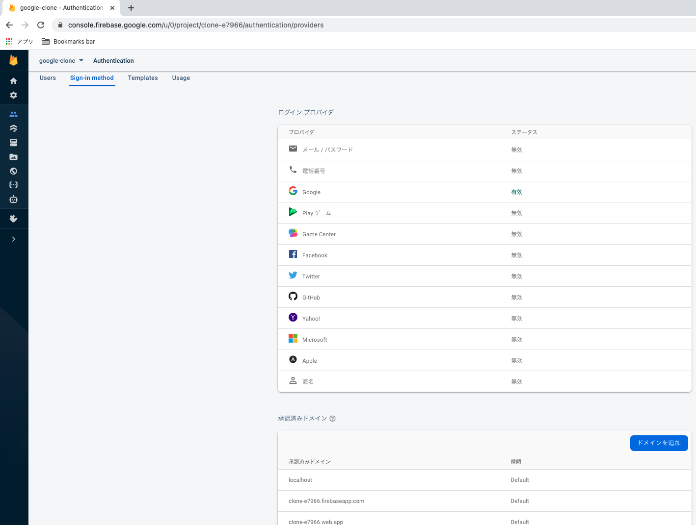
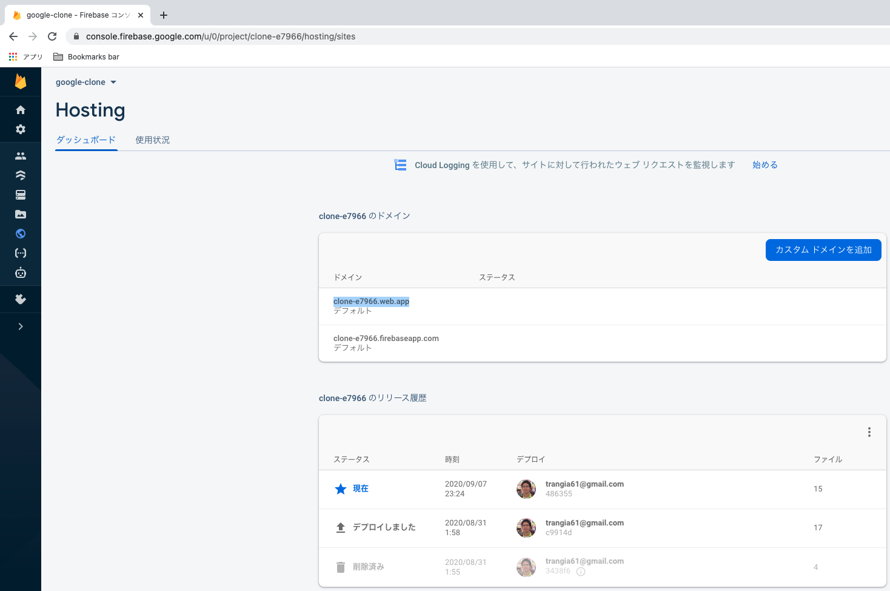

# react-firebase-google-clone-app 🧨

## 3 keys in file "Keys.js"
### API_KEY
#### create new
1. https://developers.google.com/custom-search/v1/using_rest
2. click "identify your application" of [API key]
3. click "Get a Key"
4. [Enable Custom Search API] select project="google-clone"
#### check exist
1. https://console.cloud.google.com/
2. APIの概要に移動
3. tab `認証情報`>`API キー`

### CONTEXT_KEY
1. https://cse.google.com/cse/create/new
2. Sites to search=www.google.com > Create
3. click "Get a Key"
4. Edit search engine > Setup > Basics > Search the entire web="ON"
5. Copy to clipboard "Search engine ID"

### FB_AUTH_DOMAIN
FB project dashboard

## FB

### authentication

### hosting

